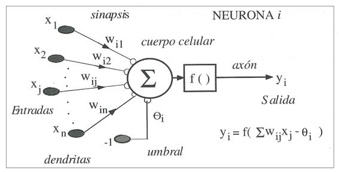
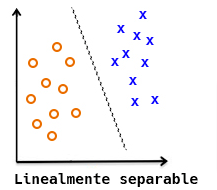
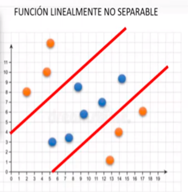
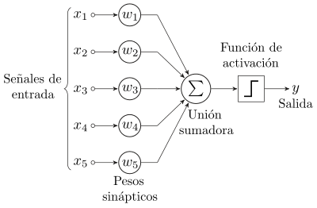

# La Neurona Artifical 22/09/22 (Perceptron Simple)

## Funcionamiento de una Neurona artifical
- Cuerpo Celular: Esta representada por el potencial post sinaptico:  $y_i=f(\sum w_{ij}*x_j - \theta{i} )$
    - $y_i$ : potencial post sinaptico de la neurona i. Señal de salida.
    - $w_i$ : peso sinaptico (conexiones, grado o nivel de conectividad).
    - $x_j$ : señal que recibe de cada neurona que se conecta con la neurona i.
    - $\theta_i$ : umbral (BIAS), a partir del cual la nuerona permanece inhibida o no.
    - $\sum w_{ij}*x_j - \theta{i}$ : potencial post sináptico. Argumento de la función de activación.
    - $f()$ : función de activación (descenso por el gradiente). 
    - 

## Arquitectura de las Redes Neuronales Arificiales
- Tienen capas.
- Modo de aprendizaje (ej: descenso por el gradiente, cnn y mlp hacen corrección del error hacia atras).
- Tienen una forma de conectividad (pueden ser alimentadas, retroalimentadas, una capa, muchas capas)
- Tipos de nueronas
- Dinámica de activación
- Es INTELIGENTE: cuando tiene la capcaidad de aprender basado en la experiencia.

### Capas de Nueronas Artificiales
- 1 (Externa INPUT)
    - Aquellas que reciben estímulos externos, relacionadas con el aparato sensorial, que tomarán la información de entrada.
- 2 (Unidades OCULTAS)
    - Dicha información se transmite a cierto elementos internos que se ocupan de su procesado. Es en la sinapsis y neuronas correspondientes a este segundo nivel donde se genera cualquier tipo de representación interna de la información. 
    - Puesto que no tienen relación directa con la información de entrada ni con la de salida, estos elementos se denominan unidades ocultas.
- 3 (Externa OUTPUT)
    - Una vez finalizado el período de procesado, la información llega a las unidades de salida, cuya misión es dar la respuesta del sistema

### Tipos de Neuronas
- Binarias o continuas
- Tipo McCulloch-Pitts
- Tipo Ising
- Tipo Potts
- Continua

### Funciones de Activación
- Función indentidad (Adalina)
- Función excalón (perceptron simple y Hopfield discreta)
- Lineal a tramos
- Tipo sigmoide (BP, derivable)
- Gaussiana
- Sinusoidales (periodicidad temporal)

### Caracterización
- Arquitectura:
    - Numero de capas
    - Numero de neuronas por capa
    - Grado de conectividad
    - Tipo de conexiones entre neuronas
- Mecanismos de aprendizaje y recuerdo o ejecución
- Representación de la información de entrada y salida

### Conexiones
- Excitatorias (peso sináptico positivo)
- Inhibitorias
- Intracapa
- Intercapa
- Realimentadas

### Extructura en capas
- Monocapas
- Multicapas

### Según el flujo de datos
- Unidireccionales (feedforward)
- Recurrentes o realimentadas

### Según el tipo de asociación (forma de representar la información)
- Hetroasociativa (ej: input una imagen, output una etiqueta). 
- Autoasociativa (ej: input una imagen, output una imagen)

### Dinámica de actualización del estado de las neuronas
- Síncronas: todas juntas, se actualizan una única vez. 
- Asíncronas: no se actualizan todas juntas.
- No determinista (estocástica): se actualizan según un motor estocástico.

## Perceptron Simple (Rosenblat 1958) 
- Es Aprendizaje supervisado
- El modelo funciona bien cuando el problema es linealmente separado: se puede trazar un hiperplano o  hiperespacio en un espacio de dimensión nxn.  - 
- El modelo no funciona bien cuando el problema es linealmente no separable.   - 
- No puede resolver la puerta lógica XOR

### Perceptron simple como Clasificador
- 
- La neurona de salida produce un potencial post sinaptico, que mediante una función de activación produce una salida.

#### Algoritmo de entrenamiento para N elementos de entrada y uno de salida (1 neurona)
- 1. Inicialización de los pesos y el umbral:
    Se asignan los valores aleatorios a cada uno de los pesos ($w_i$) y al umbral ($w_{\theta}=\theta$)
- 2. Presentación de un nuevo par (n Entradas, 1 Salida esperada)
    Presentar un nuevo aptrón de entrada junto con la salida esperada
- 3. Cálculo de la salida actual
    $$y_i=f(\sum_{i=1}^N  w_{i}* x_{i} - \theta{i} )$$
- 4. Adaptación de los pesos ---> Vuelve al punto 2.
