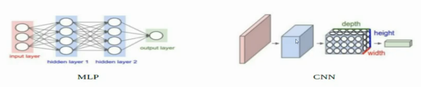

# CNN (20/10/2022)

## Ventajas de CNN y desventajas de MLP
- En MLP, a medida que se agregan neuronas en capas ocultas (hiperparámetro a controlar), se incrementa el tamaño de los arreglos de pesos sinapticos. Esto agrega complejidad computacional.
- En MLP, la restricción "Supreción del Gradiente", a medida que se avanza en capas ocultas, las capas mas alejadas tienen menos capacidad de aprender a medida que avanzan las épocas.
- Con estas dos restricciones existe la necesidad de resolverlas con otro modelo. 

## CNN
- El objetivo es reducir la dimensionalidad, la cantidad de conexiones.
- En una misma capa, se realiza el mismo proceso que en MLP, y se comparten los pesos sinapticos a lo largo del recorrido de los filtros (CONVOLUCIÓN). 
    - Se interviene la generación de nuevos pesos sinápticos.
- *Pooling:* Para reducir la dimensionalidad, se designa un representante del peso sináptico por cada agrupamiento que se toma. 
    - No interviene la generación de nuevos pesos sinápticos. 
    - Reducción del tamaño de la estructura neuronal.
- *Padding:* agrega ceros en los bordes.
    - Depende del tamaño del padding, la dimensión de los bordes que se agregan
    - Si el kernel es de 3x3, padding = 1
    - Si el kernel es de 5x5, padding = 2
- Filtros: los elije automáticamente el motor de aprendizaje. Los aprende el motor basado en el descenso por el gradiente.
    - Si no esta entrenado, lo elije random
    - En las épocas, los elije de manera que se ajusten mejor a la etiqueta de salida.
- Toda convolución tiene 1 proceso de convolución acoplado con un pooling.
- Los valores de los pesos sinapticos, los aprende gracias al BackPropagation
- Se utiliza en: 
    - Reconocimiento de objetos, de imágenes en movimiento

### Volúmenes
- Las neuronas de cada nivel están organziadas en grillas o volúmenes 3D, a diferencia de MLP que tiene una organizción lineal de neuronas en niveles. 
- 
- El height-width conservan la organización espacial "retinotípica" de la imagen de entrada. La profundiad (depth) de la tercera dimensión identifica las 'Features map'
- Los pesos se comparten en el nivel de Features map. Las neuronas de la misma Feature map procesan diferentes porciones del volumen de entrada de la misma manera. Cada Feature map puede verse como el resultado de un filtrado de entrada específico (filtro fijo).

## Principales tipos de DNN (Deep Neuronal Networks)
### Modelos predictivos "discriminatorios" para la clasificación (o regresión) con entrenamiento principalmente supervisado
- CNN (Convolutional Neural Network - ConvNet)
- FC DNN (fully connected DNN (MLP con la menos 2 niveles ocultos))
- HTM (Hierarchical Temporal Memory)

### Entrenamiento no sobredesarrolado (modelos "generativos" entrenados en reconstruir la entrada, útil para pre-entrenamiento de otros modelos y para producir características destacadas)
- Stacked (de-noising) AUTO-ENCODERS
- RBM - Restricted Boltzmann Machina
- DBN - Deep Belief Networks

### Patrones recurrentes.
- *RNN - Recurrent Neural Network* : utilizados para secuencias, reconocimiento de voz, análisis de sentimiento.
- LSTM - Long Short-Term Memory : procesamiento del lenguaje natural.

### Aprendizaje de refuerzo (para aprender comportamientos)
- Depp Q-Learning