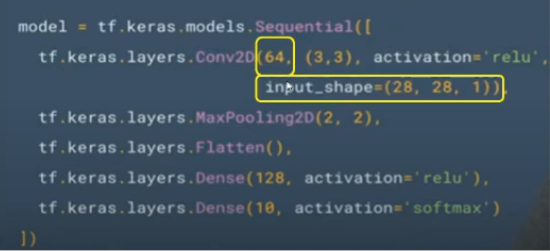

# MLP y CNN (13/10/2022)

## Funciones de activación
- Sigmoide: es una función continua.
    - Los valores son graduales
    - Tiene una tendencia a llevar los términos de backpropagation a cero durante el entrenamiento.
- Relu: acelera la convergencia del Descenso por el Gradiente Estocástico (SGD)
    - La velocidad de aprendizaje puede hacer que los pesos *w* de la neurona se actualicen y oscilen desde los valores óptimos y no se activen en ningún punto.
    - Ej: si la taza de aprendizaje es demasiado alta, la mitad de las neuronas pueden estar -muertas-, pero si se establece un valor apropiado, entonces la neuronas aprenderán, pero será mas lento que lo esperado.
- Relu6: computacionalmente más rápida y no sufre de valores que explotan.
    - Utilizada en redes neuronales Convolucionales (CNN) y Recurrente (RNN)
- Tanh: similar a la sigmoide, pero en lugar de tener un rango entre 0 y 1, el rango es de -1 a 1.
- Softmax: convierte un vector de valores a una distribución de probabilidad de suma 1. 
    - Difiere del resto, ya que esta función se la utiliza como la capa final en clasificadores basados en redes neuronales
    - También es utilizada en aprendizaje reforzado para convertir valores en probabilidades de actuación

## Deep Learning
- Capas ocultas superior a 15.
- 3 niveles de reconocimiento de características principales:
    - Low-Level Features
    - Mid-Level Features
    - High-Level Features
- Después: Trainable Classifier
- Toda esta etapa previa, esta automatizada: se toman la imágenes crudas, se automatizan filtros para que el algoritmo elija esos filtros y hace un proceso de convolución y de pooling para penalizar la complejidad. De esta forma emerjen las características.
- 
    - Convolución 2D
    - 64: filtros
    - (3,3): tamaño del filtro
    - MaxPooling2D: reducir la dimensionalidad. (2,2) abarca 4 pixels, y obtiene uno solo.